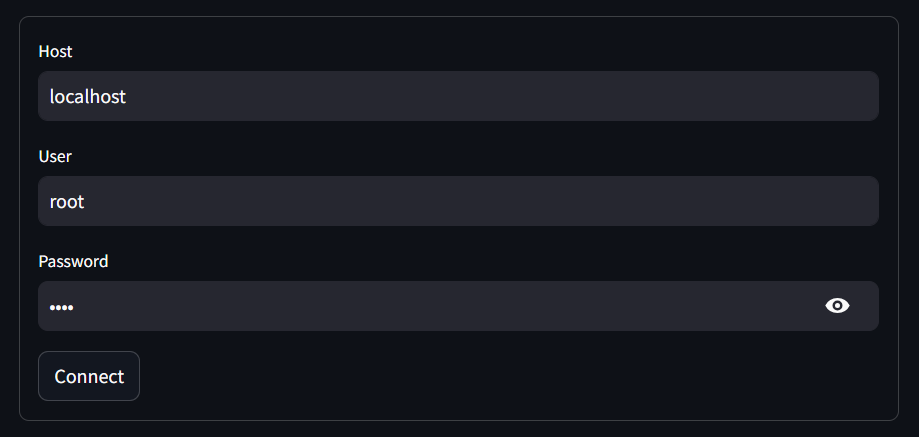
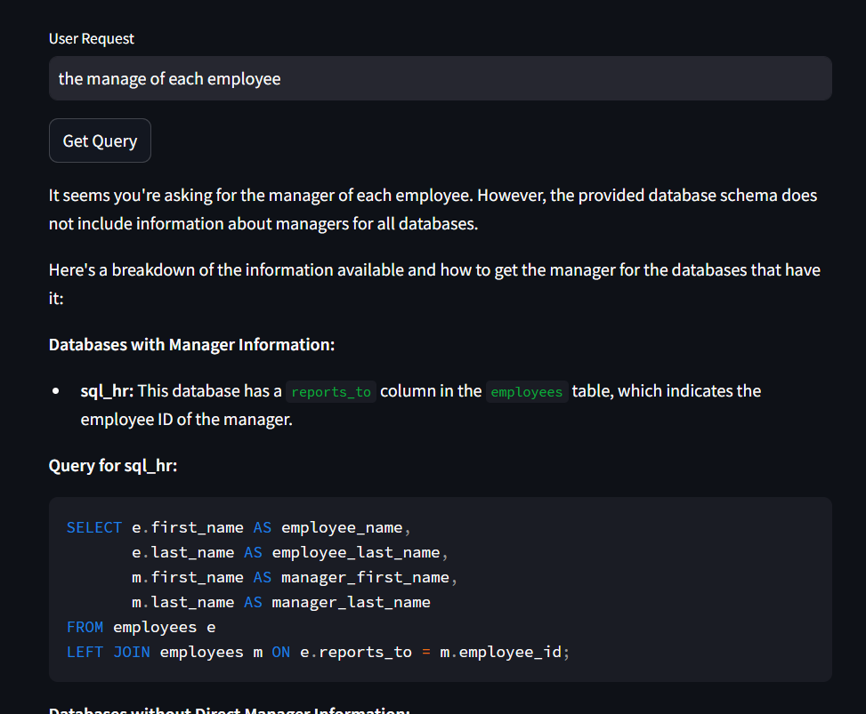

# Use LLM with MySQL

## Connect to MySQL server

first, you need to establish a connection to the MySQL server. so you need to know the host, user, and password of the MySQL server.

## User Request

after establishing a connection to the MySQL server, the system will get all the databases information. then the user can ask the LLMs what he wants to do.

## LLM Result

Thee LLm will give the user the query that he needs to execute to get the result, some information about the query, examples, and explanation of the query.
